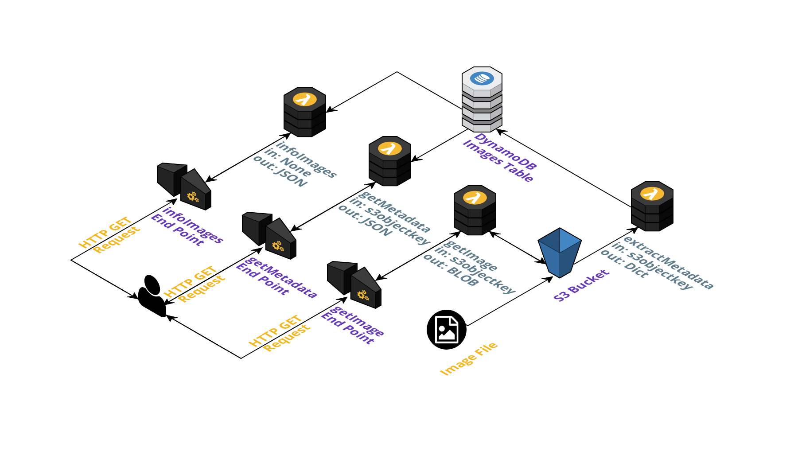

# AWS Serverless com Python

## Escopo e Desenvolvimento

---

<p>Proposta do desafio: Desenvolver uma aplicação para realizar análise de imagens e fornecer pontos de acesso aos usuários.
A aplicação será formada pelas seguintes funções utilizando o serviço AWS Lambda e a linguagem Python:</p>

* **extractMetadata**: É chamada quando um novo arquivo é carregado no S3. Ela extrai os metadados da imagem e os armazena no DynamoDB.
* **getMetadata**: Recebe uma requisição GET, através do API Gateway na rota */images/*, acompanhada do parâmetro s3objectkey e retorna um JSON com os metadados da imagem solicitada.
* **getImage**: Recebe uma requisição GET, através do API Gateway na rota */images/download/*, acompanhada do parâmetro s3objectkey e retorna o binário da imagem salva.
* **infoImages**: Recebe uma requisição GET, através do API Gateway na rota */summary/*, e retorna uma análise de todas as imagens salvas no servidor.

## Esboço da Arquitetura

---



### Bibliotecas Utilizadas:
* **json**: Utilizada para formatar a resposta contida no body da response entregue ao API Gateway.
* **concurrent**: Utilizada para gerenciar o processamento paralelo (concorrente) na função extractMetadata.
* **typing**: Utilizada para a criação de alguns dos type hints utilizados no código.
* **PIL**: Utilizada para pegar alguns metadados da imagens inseridas no bucket. Esta, ainda, possui funções interessantes para tratamento de imagens.
* **urllib**: Durante uma requisição HTTP, alguns caracteres podem ser substituídos por sua sequência hexadecimal. A biblioteca foi utilizada para traduzir essa sequência hexadecimal.
* **boto3**: Utilizada para conversar com as aplicações da AWS como DynamoDB e S3.
* **base64**: Utilizada para converter binários em um texto hexadecimal que possa navegar pela web e ser compreendido pelo browser do usuário.
* **decimal**: Utilizada para tratar dados numéricos salvos no DynamoDB.
* **collections**: Utilizada para contar a ocorrência de determinados valores em um dicionário.
* **botocore**: Utilizada para tratar algumas exceções que podem ocorrer.

## Como Rodar

---

Para rodar esta aplicação, idealmente, deve-se seguir o seguinte passo-a-passo.

1. Caso não tenha instalado o NPM, é fundamental que o mesmo sejá instalado. Para maiores informações, acesse o [Portal Oficial da Tecnologia](https://www.npmjs.com/).
2. Através do terminal, rode o comando *npm install -g serverless* como mostrado a seguir:
```console
foo@bar:~$ npm install -g serverless
Instalando o Serverless
...
foo@bar:~$
```
3. Caso tenha o git instalado, clone este repositório. Caso contrário, baixe o zip contendo os arquivos do repositório do GitHub - neste caso, descompacte o arquivo após o download.
```console
foo@bar:~$ git clone https://github.com/foo/bar
Cloning into 'bar'...
.
.
.
..., done.
foo@bar:~$
```
4. Por meio de sua conta AWS, crie um usuário através do serviço IAM.
5. Configure o serverless através do terminal utilizando as chaves pública e secreta geradas.
```console
foo@bar:~$ serverless config credentials --provider aws --key foo --secret bar

foo@bar:~$ 
```
6. Através do terminal, acesse a pasta clonada (ou descompactada) e rode o comando *serverless deploy*.
> **Obs**: Antes de executar o passo 6, deve-se estar ciente de que o comando pode falhar por já haver um bucket com o mesmo nome do bucket configurado no arquivo *serverless.yml*. Neste caso, altere o nome do bucket neste arquivo e no arquivo *handlerGI.py* para a correta execução da aplicação.

&nbsp;
 
```console
foo@bar:~$ serverless deploy
Executando o Serverless
...
foo@bar:~$ 
```
7. Após concluído, acesse o serviço S3 da AWS e, na bucket configurada (kalingcket), crie uma pasta chamada uploads. Nesta pasta que deverão ser armazenadas as imagens.
8. Após a conclusão destes passos, pode começar a utilizar a aplicação conforme foi requisitada. :smiley:

> **Obs**: Qualquer dúvida, não hesite em me contatar, preferencialmente, através de meu [LinkedIn](https://www.linkedin.com/in/htgnilak/).

## Aprendizados

---

<p>Durante a execução deste projeto, tive meu primeiro contato com a cloud da Amazon e a experiência foi fantástica. Já consigo imaginar inúmeras formas de criar novos projetos baseados nas tecnologias da AWS.</p>
<p>Para desenvolver este projeto, acabei indo fundo em estudos relacionados à Cloud em cursos como: <b>Primeiros passos com AWS</b>, <b>Introdução prática à computação na nuvem usando AWS</b> e <b>Criando uma Aplicação Serverless na AWS</b> todos fornecidos pela <b>Digital Innovation One</b>. </p>
<p>Graças a todos esses conhecimentos adquiridos, fui capaz de passar na avaliação de competências em <b>Amazon Web Services</b> do <b>LinkedIn</b>. </p>